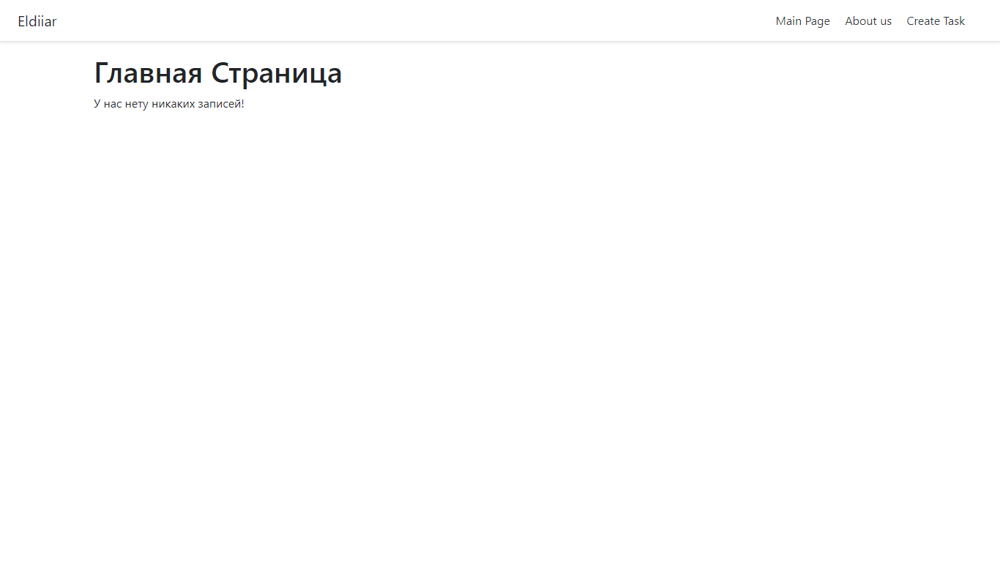
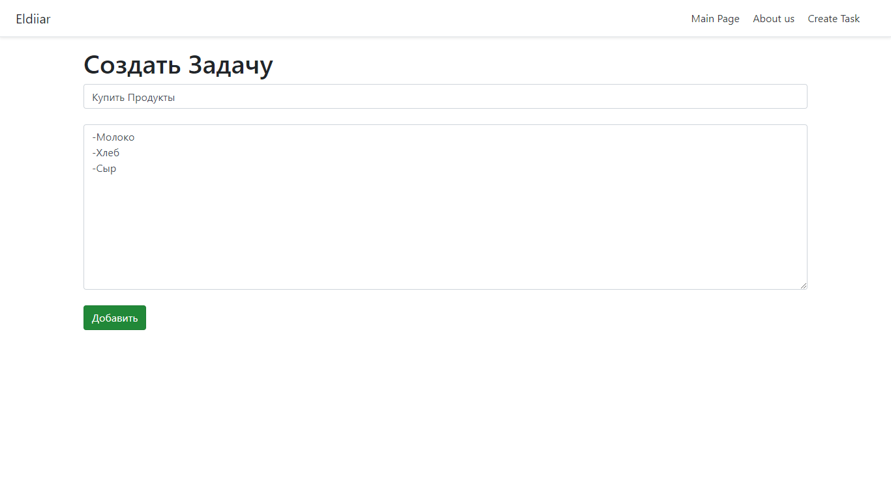
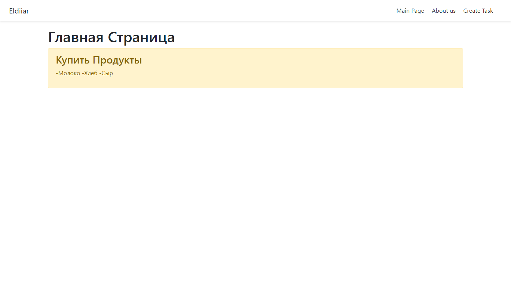

## This project is a task manager, you add task and description. Then, you will be able to see them in the main page sorted by their id.

Django==3.0.7 was used while creating it and the source was this youtube video

https://www.youtube.com/watch?v=6K83dgjkQNw

```
pip3 install Django==3.0.7
```
Image 1

Image 2

Image 3

