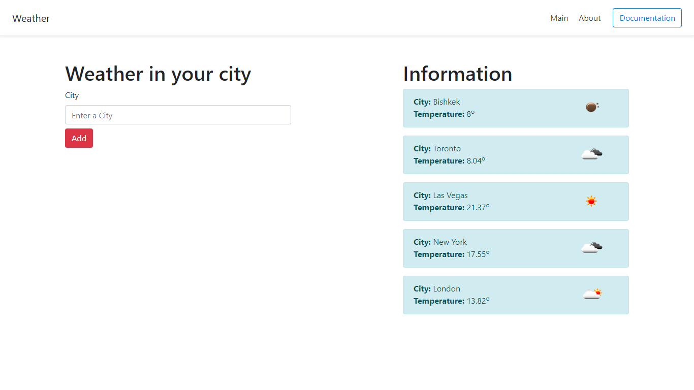
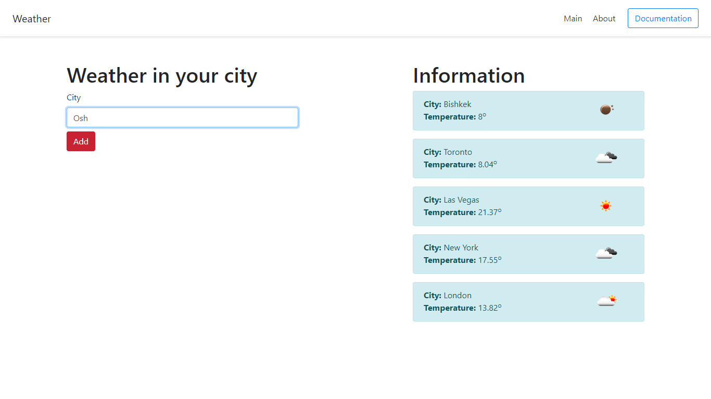
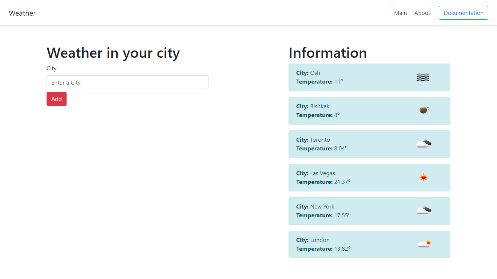

## This project is a weather app. It shows the list of the cities with their weather. Cities may be added with the add button


## This project is a task manager, you add task and description. Then, you will be able to see them in the main page sorted by their id.

Django==2.1.7 was used while creating it and the source was this youtube video

https://www.youtube.com/watch?v=lsAbq2RcWlQ&list=PL0lO_mIqDDFXx5_8RmAqAmD_Cdb9DV-H5&index=12

```
pip3 install Django==2.1.7
```

#
## Image 1

## Image 2

## Image 3

